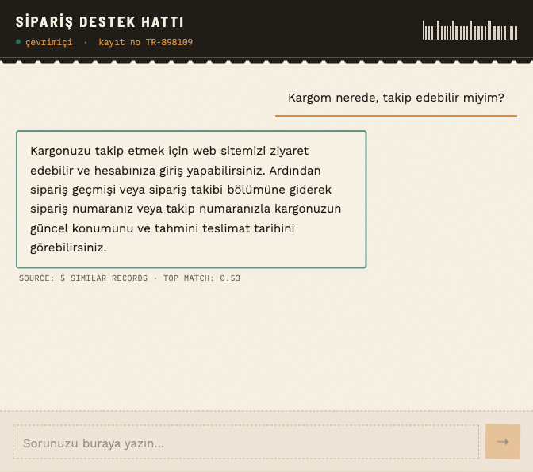

# E-commerce Support Chatbot

A multilingual, retrieval-augmented customer support chatbot for e-commerce.
It embeds a 44,884-row English support dataset into a vector database, then
answers customer questions in **whatever language they're asked in** by
retrieving the most similar past support records and having an LLM
synthesize one clean answer from them.

**Live demo:** [microsoftprojesi.duckdns.org](https://microsoftprojesi.duckdns.org/)



## How it works

```
User question (any language)
        │
        ▼
  Voyage AI embedding  ──►  Qdrant similarity search (top-5)
        │                          │
        │                          ▼
        │                  5 similar Q&A records + scores
        │                          │
        ▼                          ▼
              Gemini (system prompt + context)
                        │
                        ▼
              One synthesized answer, same language as the question
```

1. **Retrieval** — the user's question is embedded with Voyage AI
   (`voyage-4-large`) and compared against 44,884 pre-embedded support
   records in Qdrant using cosine similarity. No translation step: the
   embedding model handles cross-lingual matching directly (a Turkish or
   Spanish question can match English dataset rows).
2. **Generation** — the top-5 matches (with their similarity scores) are
   given to Gemini, which writes one coherent answer in the same language
   the question was asked in. If the matches are weak or off-topic, the
   model says so and suggests contacting a human agent instead of guessing.

See [`docs/adr/`](docs/adr) for the full reasoning behind each design
decision, and [`docs/glossary.md`](docs/glossary.md) for term definitions.

## Stack

| Layer | Technology |
|---|---|
| Frontend | React + Vite + Tailwind CSS v4 |
| Backend | Python, FastAPI |
| Vector DB | Qdrant |
| Embeddings | Voyage AI (`voyage-4-large`) |
| Answer generation | Google Gemini (`gemini-flash-lite-latest`) |
| Deployment | Docker Compose |

## Project layout

```
backend/          FastAPI app (backend/app/main.py, backend/app/rag.py)
frontend/          React chat UI
scripts/
  ingest.py         One-time batch job: embed the dataset and load it into Qdrant
  pilot_verify.py    Cross-lingual retrieval validation used before committing to a provider
docs/
  adr/              Architecture Decision Records
  glossary.md        Project terminology
docker-compose.yml  Qdrant + backend, one command deploy
```

## Running locally

Requires [`uv`](https://docs.astral.sh/uv/) and Node.js 20+.

1. **Start Qdrant** (or point at a remote instance):
   ```bash
   docker run -p 6333:6333 -v ./qdrant_storage:/qdrant/storage qdrant/qdrant
   ```
2. **Set environment variables** — create `backend/.env`:
   ```
   GEMINI_API_KEY=...
   VOYAGE_API_KEY=...
   QDRANT_URL=http://localhost:6333
   ```
3. **Ingest the dataset** (root project, needs the same `.env` values):
   ```bash
   uv run python scripts/ingest.py
   ```
4. **Run the backend**:
   ```bash
   cd backend && uv sync && uv run uvicorn app.main:app --reload --port 8001
   ```
5. **Run the frontend**:
   ```bash
   cd frontend && npm install && npm run dev
   ```

## Deploying

```bash
docker compose build backend
docker compose up -d
```

This builds the frontend and backend into a single image (see
`backend/Dockerfile`) and serves everything from FastAPI on port 8000
(mapped to 8080 in `docker-compose.yml`).

## Design decisions worth knowing about

- **No translation step** — cross-lingual matching is handled entirely by
  the embedding model (ADR-001).
- **No hard similarity threshold** — the LLM is given raw scores and judges
  relevance itself rather than a fixed cutoff deciding pass/fail (ADR-002).
- **Only the `instruction` field is embedded** — `response`, `category`,
  and `intent` are stored as payload and surfaced to the LLM as context,
  not searched directly (ADR-003).
